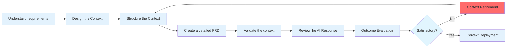

# Agentic Development Workflow Proposal 2025

## Alive

---

# 是否可能用 Agent 來開發、部署和維護產品(Production Ready)?

<v-clicks>

**SHORT ANSWER:** YES

**LONG ANSWER:** YES BUT ...需要**適當的**背景條件

> 甚至可以說是嚴苛的

</v-clicks>

---

# 已知趨近成功的條件

<v-clicks>

## 1. Claude Code
與其他所有工具的能力有斷層上的差別

## 2. Context Engineering
遵循 Context Engineering, NO VIBE CODING

## 3. Review Process
建立適當, 或者該說, 更嚴謹的審查流程

</v-clicks>

---

# Why is Claude Code ?

<v-clicks>

## 成功案例
- Successful stories: https://www.anthropic.com/customers

## 與其他工具的差異 (cursor, windsurf, gemini...)
- **上下文大小**
- **Indexing 方式**
- **模型本身能力**
- **CLI 整合** - 易於整合進 CI/CD 流程

</v-clicks>

---

# Context Engineering

<v-clicks>

- 從寫程式轉向寫文件
  - 現在雖然有文件但是不是 SSOT, 沒有更新又散落各地
  - 沒有經過 agent 開發的檢驗，有很多"無效"的文件
  - 文化/範式上的改變
- Single source of truth, NO TRIBE KNOWLEDGE
  - 很少看到回頭更新文件 - 證明這是說起來簡單實行起來困難的事情
  - Documentation As Code
  - AI First = Documentation First = Spec First = API First
- Decision making
  - 花更多時間 planning/strategy/learning
  - 實際執行者交給 AI - 把騰出來的時間用來決策
  - OK, 但為什麼需要 Learning?
    - 沒有 Learning = 沒有 knowledge = 做不出決策，只能被動讓 AI 決策
</v-clicks>

---

# Success Story - Reshape development workflow

* From [Crescendo lab](https://medium.com/%E6%BC%B8%E5%BC%B7%E5%AF%A6%E9%A9%97%E5%AE%A4-crescendo-lab-engineering-blog/making-an-impact-beyond-delivery-how-engineers-reshape-product-development-with-ai-f46560449d2f)

1.

> 透過深入研究程式碼庫和 AI 工具，他們提煉出清晰的 AI 編碼原則和一個框架，使在遺留系統上進行產品開發的速度比普通的自動完成功能快 1.6 倍（詳情請參閱我們的開源程式碼庫）。
這就是全部嗎？完全不是。為了實現這一點，他們還重新設計了產品開發流程，並用實際產品規格進行了驗證，將端到端交付生命週期縮短了 1.7 倍，同時將 QA 缺陷率從 20% 降低到了 8%。

2.

> 為了盡量減少往返次數，我們審查了產品開發流程，發現了幾個「壞味道」：
> - 沒有單一事實來源
> - 決策是在會議上做出的，但很少反映到 PRD 中；筆記分散在 Slack 和 Google Docs 上。
> - **未規範的 PRD**
> - 規範是描述性的而非規範性的，缺乏狀態、觸發器、邊緣情況和驗收標準。每個人填補空白的方式都不同，導致返工和缺陷。
> - 為期數週的協調為期
> - 10 至 12 週的計畫通常只需花費 2 至 3 週的時間來協調需求。
> - 高 QA 缺陷率
> 我們最初的 QA 通過率徘徊在 80% 左右，甚至快樂路徑有時也會失敗 - 這是錯位的明顯證據。 

---

# Success Story (CONT.)

3.

> 在深入分析了這些問題之後，我們發現根本原因在於，像我們這樣的節奏緊湊新創公司，人們沒有時間和動力去做專案管理。對於團隊中所有職能部門（專案經理、產品開發、工程師）來說，總有比這更重要的任務。因此，這構成了一種影響每個人卻無法改變的隱患，最終導致惡性循環。

我的理解：
* 因為沒有時間 => 總是在做一些 Output First 的工作，最終導致更沒有時間打磨 Input(Context)
* Agent 出現後，產出 Output 的角色從 Human 轉為 AI，我們終於得以騰出時間

---

# Context Engineering Workflow

* 不可發散，永遠要回頭更新規格
* 寫規範性的規格
  - 如果曾經過去嘗試 Spec First 失敗了，那代表規格本身並不具備執行性
  - AI 是檢查可執行性的重要角色

---

# Review Process

- 有，但不多
- 部分小型團隊 - 只做不 review
- 時間問題：為了趕交付因為沒有時間 review
- 知識問題：沒有足夠知識背景可以 review

---

# Possible Challenges

<v-clicks>

1. Culture Shock - 開發團隊需要適應新的工作模式
2. 執行細節 - 實際執行過程中的技術和流程細節微調
3. 跨部門認知 - 不同部門對於 AI 輔助開發的理解和接受度差異
4. 基礎建設
- 實際的軟硬體基礎建設 （用什麼工具確保 SSOT ?)
- 對於 mental 方面的基礎建設 (人類不該變成只會對 AI 執行結果按 YES 的一顆石頭)

</v-clicks>

---

# 2 Cents

<v-clicks>

1. 使用正確的工具
2. 使用正確的做法
3. 維持正確的心態

> 1 和 2 之間其實有個巨大的 GAP
>- 現在很多單一個體可能多少有在使用 ai 輔助，但沒有人去試著把點連成線構成面的話對最終結果影響不大

</v-clicks>

---

# ETC

<v-clicks>

1. 非研發職可能需要學會 Vibe Coding
2. 每人至少一個 PRO 等級以上帳號
3. 職能之間的界線會模糊化
4. 系統架構受組織通訊結構影響(康威定律)
   - 反過來利用康威定律（反康威定律），正式將 Agent 視為開發流程中的一個重要單元
   - 透過 Context (as API between Human and Agent) 重新定義通訊方式

</v-clicks>

---

# Q&A

<v-clicks>

* 多人同時運作的情況？
  - 維持原本的做法：各職能各自維護自己的 Context，以及 review 自己職能在 AI 上產出的 Output
  - 縮減團隊規模：TBD

</v-clicks>

